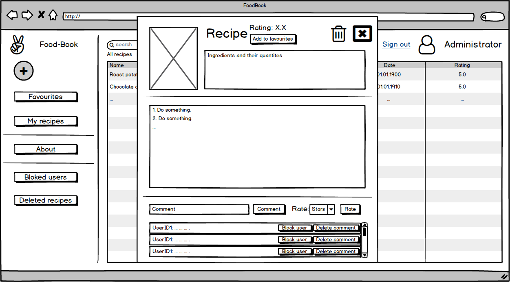
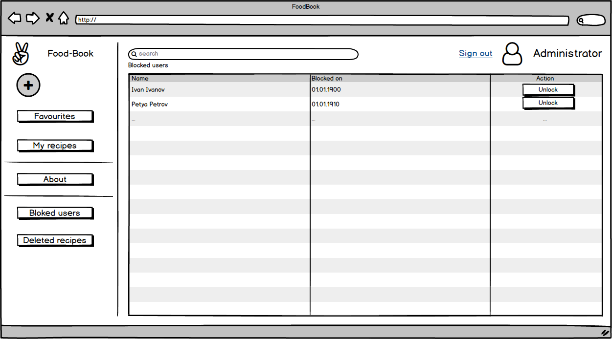
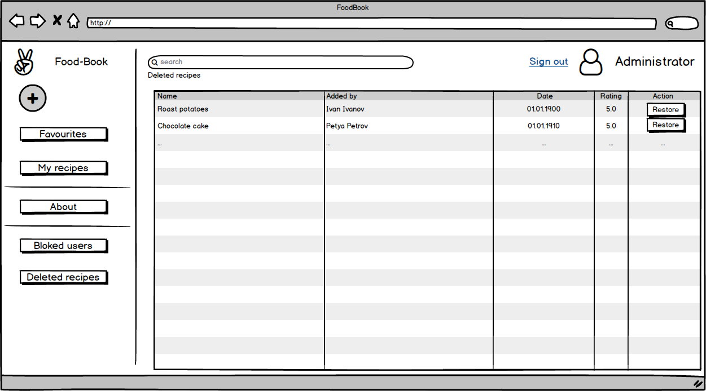

# Спецификация требований к программному обеспечению

## Содержание

1. [Введение](#1)
   1. [Назначение](#1.1)
   2. [Аналоги](#1.2)
2. [Общее описание](#2)
   1. [Видение продукта](#2.1)
   2. [Классы и характеристики пользователей](#2.2)
3. [Функциональность системы](#3)
   1. [Программные интерфейсы](#3.1)
   2. [Описание сущностей](#3.2)
   3. [Интерфейс пользователя](#3.3)
4. [Системные требования](#4)

<a name = "1">

## 1. Введение
</a>
<a name = "1.1">

### 1.1 Назначение
</a>
В этом документе описаны функциональные и нефункциональные требования к веб-приложению FoodBook.

<a name = "1.2">

### 1.2 Аналоги
</a>

|Функции|Zest|Gourmet|FoodBook|
|---|:-:|:-:|:-:|
|Добавление рецептов|+|+|+|
|Изменение рецептов|+|+|+|
|Удаление рецептов|+|+|+|
|Оценка рецептов|+|+|+| 
|Комментирование рецептов|-|-|+|
|Кроссплатформенность|-|-|+|

<a name = "2">

## 2. Общее описание

</a>
<a name = "2.1">

### 2.1 Видение продукта

</a>

Веб-приложение FoodBook является менеджером кулинарных рецептов с широкими возможностями. FoodBook позволяет осуществлять поиск рецептов и сортировку их по различным параметрам (сложность приготовления, популярность). При наличии учетной записи пользователь может создавать, изменять, удалять свои кулинарные рецепты.

<a name = "2.2">

### Классы и характеристики пользователей

</a>
Данное приложение предназначено для пользователей, имеющих базовые навыки работы с компьютером, в частности, с интернет-браузером. В приложении предусмотрены три группы пользователей.

|Функции|Незарегестрированный пользователь (гость)|Зарегестрированный пользователь|Администратор|
|---|:-:|:-:|:-:|
|Поиск рецепта по названию|+|+|+|
|Поиск рецепта по ингредиентам|+|+|+|
|Добавление рецепта в избранное|-|+|+|
|Оценка рецепта|-|+|+|
|Комментирование рецепта|-|+|+|
|Добавление своих рецептов|-|+|+|
|Изменение своих рецептов|-|+|+|
|Удаление своих рецептов|-|+|+|
|Блокировка пользователей|-|-|+|
|Удаление комментариев к рецептам|-|-|+|
|Удаление любых рецептов|-|-|+|

<a name = "3">

## 3. Функциональность системы

</a>
<a name = "3.1">

### 3.1 Программные интерфейсы
</a>

Приложение разработано на языке C# с использованием .NET CORE 2.2.2 (backend) и React.js (frontend).

<a name = "3.2">

### 3.2 Описание сущностей

</a>

#### Рецепт
Для создания рецепта ___обязательны___ и ___достаточны___ следующие поля:
* Название -- это словесное обозначение рецепта.
* Описание -- кратко изложенная информация о рецепте, состоит из:
  * фотографии (как минимум одна фотография),
  * личные рекомендации автора (наличие необязательно).
* Ингредиенты -- состав рецепта с указанием количества продуктов. Например, вареная колбаса - 300 грамм.
* Описание процесса приготовления -- список промежуточных действий с комментариями автора. Например, взять колбасу и нарезать ее кубиками.

При отображении рецепта добавляются следующие поля:
* Автор -- имя пользователя, создавшего рецепт (наличие обязательно).
* Комментарии (наличие обязательно)
* Оценка по пятибалльной шкале (наличие обязательно).

Оценить рецепт и оставить комментарий может только зарегестрированный пользователь.

#### Гость (незарегестрированный пользователь)

Имеет право осуществлять поиск по рецептам, созданными другими пользователями. А также при необходимости создать учетную запись пользователя.

#### Зарегистрированный пользователь

У пользователя есть следующие поля:
* имя пользователя
* адрес электронной почты
* пароль
* список любимых рецептов. Формируется из тех рецептов, при просмотре которых зарегистрированный пользователь добавил их в список любимых рецептов (нажал кнопку "Add to favourites").
* список лично им созданных рецептов. Формируется из тех рецептов, которые зарегистрированный пользователь создал сам.

Все пользователи могут видеть список всех рецептов (тех, которых добавили зарегистрированные пользователи) и имеют право осуществлять по ним (рецептам) поиск.

<a name = "3.3">

### 3.3 Интерфейс пользователя
</a>

Главная страница.

Окно просмотра рецепта.

Страница регистрации.

Страница авторизации.

Окно создания рецепта.

Окно просмотра пользователем своего рецепта.

Окно изменения рецепта.

Окно About.

Окно Feedback.

Окно для связи с администратором (для заблокированных пользователей)

Главное окно для администратора.

Окно просмотра рецептов (не своих) для администратора.

Страница с заблокированными пользователями.

Страница с удаленными рецептами.

<a name = "4">

### 4. Системные требования.

</a>

Требования к проекту предствалены в формате [пользовательских историй](UserStory.md).