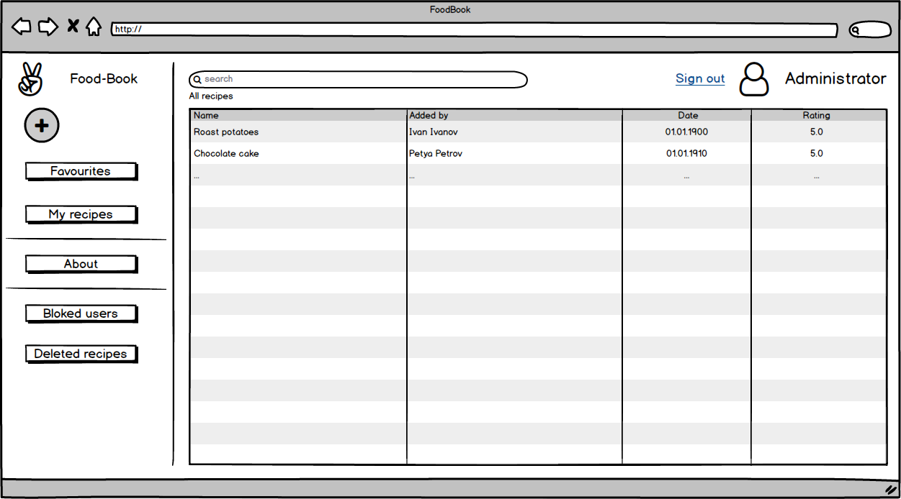

# Спецификация требований к программному обеспечению

## Содержание

1. [Введение](#1)
   1. [Назначение](#1.1)
   2. [Аналоги](#1.2)
2. [Требования пользователя](#2)
   1. [Программные интерфейсы](#2.1)
   2. [Интерфейс пользователя](#2.2)
   3. [Характеристики пользователей](#2.3)
3. [Системные требования](#3)

<a name = "1">

## 1. Введение
</a>
<a name = "1.1">

### 1.1 Назначение
</a>
В этом документе описаны функциональные и нефункциональные требования к веб-приложению FoodBook.

<a name = "1.2">

### 1.2 Аналоги
</a>

|Функции|Zest|Gourmet|FoodBook|
|---|:-:|:-:|:-:|
|Добавление рецептов|+|+|+|
|Изменение рецептов|+|+|+|
|Удаление рецептов|+|+|+|
|Оценка рецептов|+|+|+| 
|Комментирование рецептов|-|-|+|
|Кроссплатформенность|-|-|+|

<a name = "2">

## 2. Требования пользователя

</a>
<a name = "2.1">

### 2.1 Программные интерфейсы
</a>

Приложение разработано на языке C# с использованием .NET CORE 2.2.2 (backend) и React.js (frontend).

<a name = "2.2">

### 2.2 Интерфейс пользователя
</a>

Главная страница.

Окно просмотра рецепта.

Страница регистрации.

Страница авторизации.

Окно создания рецепта.

Окно просмотра пользователем своего рецепта.

Окно изменения рецепта.

Окно About.

Окно Feedback.

Окно для связи с администратором (для заблокированных пользователей)

Главное окно для администратора.

Окно просмотра рецептов (не своих) для администратора.

Страница с заблокированными пользователями.

Страница с удаленными рецептами.

<a name = "2.3">

### 2.3 Характеристики пользователя
</a>
Данное приложение предназначено для пользователей, имеющих базовые навыки работы с компьютером, в частности, с интернет-браузером. В приложении предусмотрены три группы пользователей.

|Функции|Незарегестрированный пользователь (гость)|Зарегестрированный пользователь|Администратор|
|---|:-:|:-:|:-:|
|Поиск рецепта по названию|+|+|+|
|Поиск рецепта по ингредиентам|+|+|+|
|Добавление рецепта в избранное|-|+|+|
|Оценка рецепта|-|+|+|
|Комментирование рецепта|-|+|+|
|Добавление своих рецептов|-|+|+|
|Изменение своих рецептов|-|+|+|
|Удаление своих рецептов|-|+|+|
|Блокировка пользователей|-|-|+|
|Удаление комментариев к рецептам|-|-|+|
|Удаление любых рецептов|-|-|+|

<a name = "3">

3. Системные требования.
</a>

Требования к проекту предствалены в формате [пользовательских историй](UserStory.md).