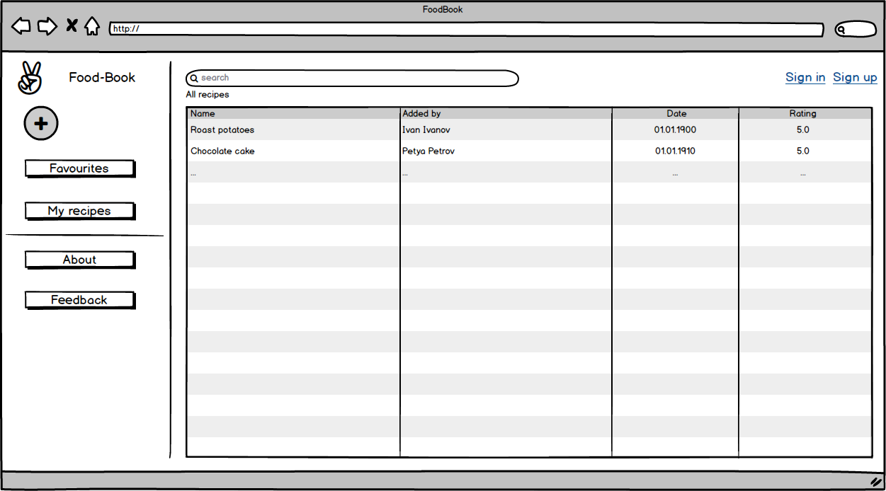
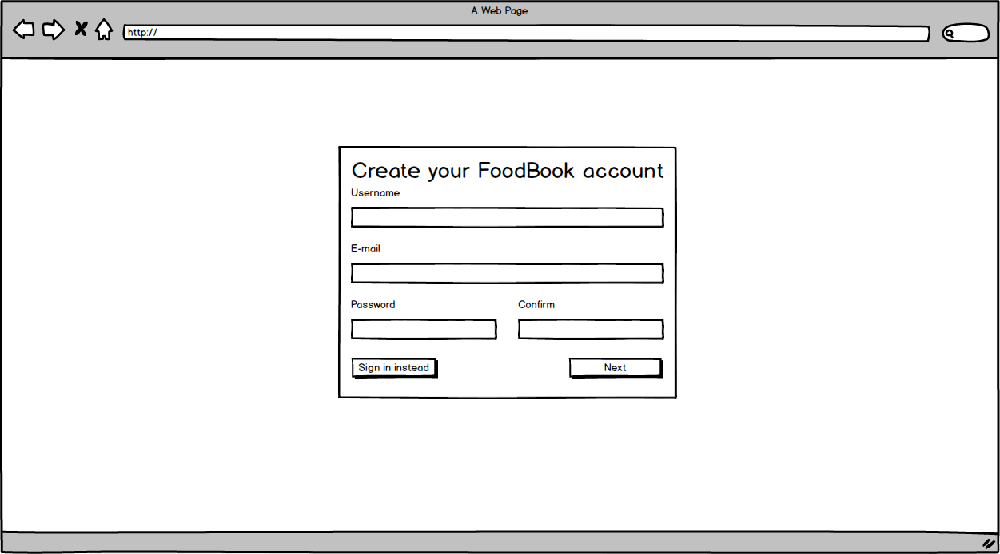
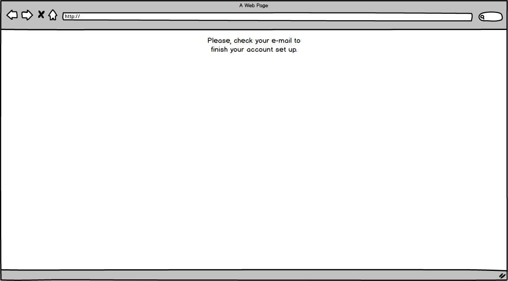
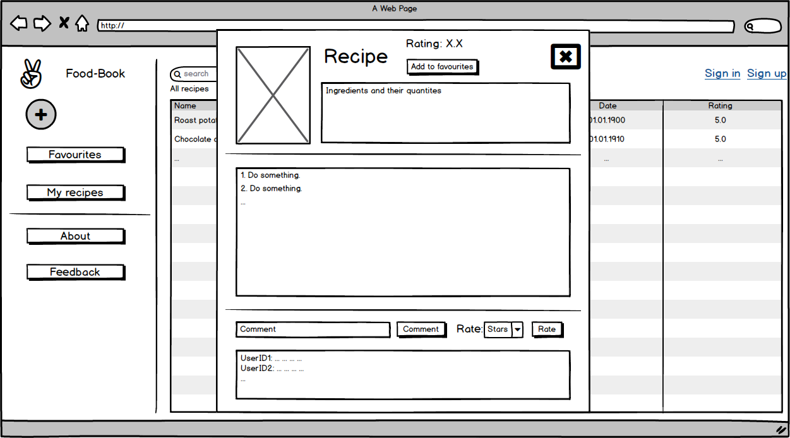
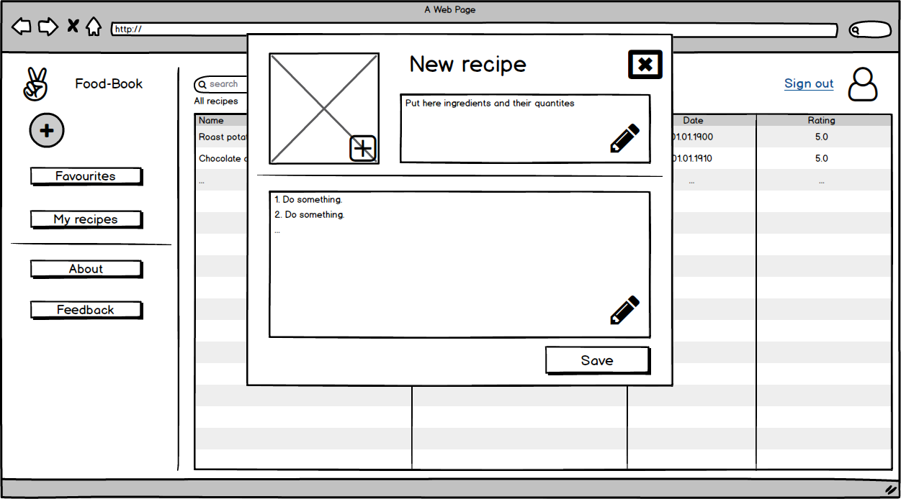
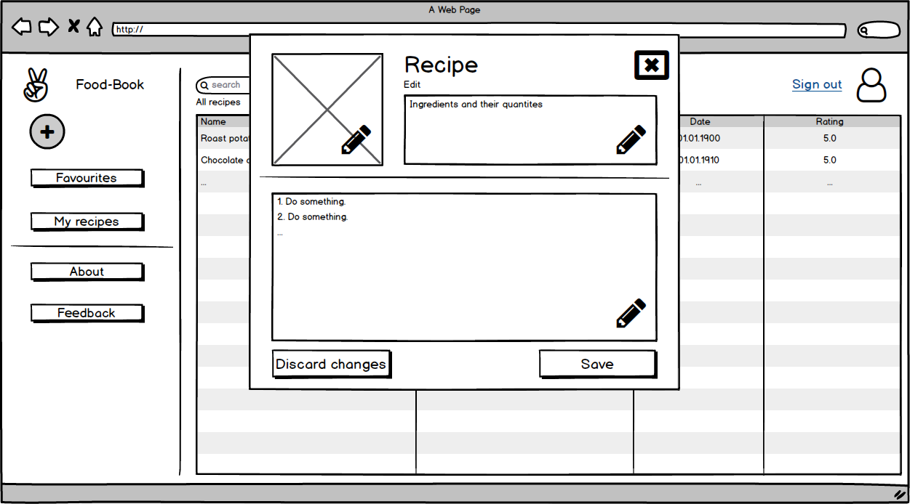
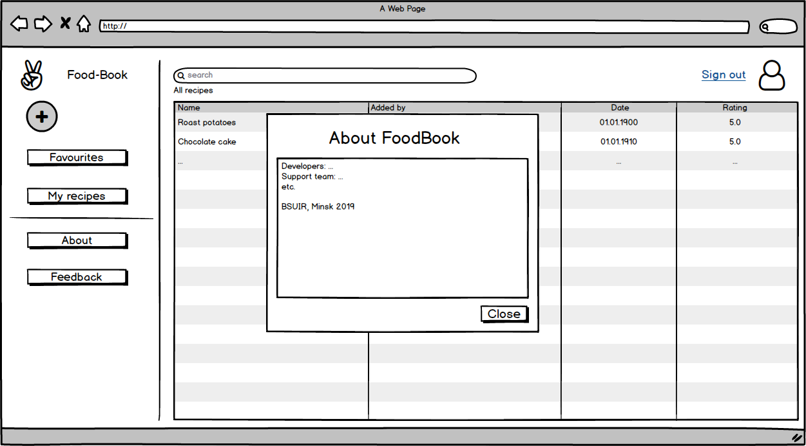
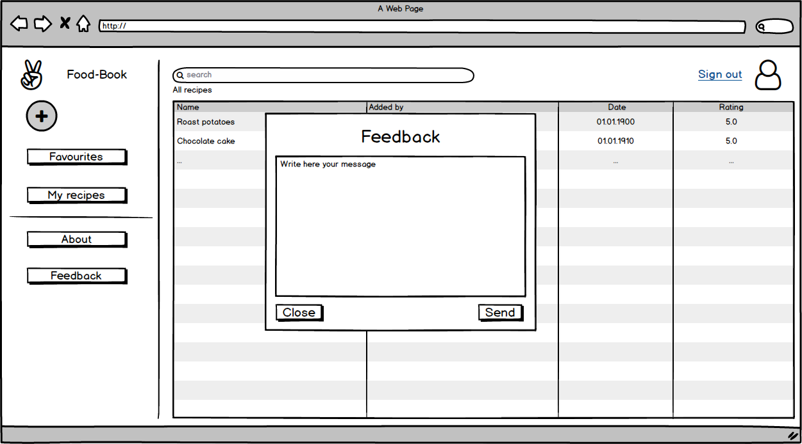

# Пользовательские истории к проекту FoodBook

1.  Я как гость хочу иметь возможность поиска рецептов по названию, чтобы не тратить время на регистрацию.

2.  Я как гость хочу иметь возможность поиска рецептов по входящим в состав игредиентам, чтобы не вспоминать название необходимого рецепта.

3.  Я как гость хочу создать аккаунт пользователя (нажатие на 'Sign up'), чтобы иметь возможность добавлять свои рецепты.

4.  Я как пользователь хочу при нажатии на кнопку 'Sign in' перейти на страницу ввода логина и пароля, чтобы войти в свой аккаунт.

5.  Я как пользователь хочу при нажатии на рецепт видеть полное его описание, чтобы знать, как его приготовить.
    1.  ... хочу иметь возможность добавлять рецепты в избранное (нажатие на 'Add to favourites'), чтобы любимые рецепты были всегда в одном месте.
    2.  ... хочу ставить свою оценку рецепту (нажатие на 'Rate'), чтобы рецепты имели свои рейтинги.
    3.  ... хочу оставлять комментарии к рецепту (нажатие на 'Comment'), чтобы другие пользователи могли видеть мое субъективное мнение по поводу рецепта.

6.  Я как пользователь хочу добавлять свои рецепты (нажатие на '+'), чтобы другие пользователи могли их видеть:
     1.  ... хочу добавить одно фото блюда.
     2.  ... хочу написать список ингредиентов в отдельном пространстве, чтобы рецепт выглядел структуризованно.
     3.  ... хочу написать последовательность действий в отдельном пространстве, чтобы рецепт выглядел структуризованно.

7.  Я как пользователь хочу управлять своими рецептами:
    1.  ... хочу изменять свои рецепты, чтобы они были всегда актуальными.
        1.  ... хочу иметь возможность изменить фото блюда.
        2.  ... хочу иметь возможность изменить список ингредиентов.
        3.  ... хочу иметь возможность изменить последовательность действий при приготовлении.
    2.  ... хочу удалять свои рецепты, чтобы у меня не было лишних рецептов.

8.  Я как пользователь хочу при нажатии на кнопку 'About' получить информацию о приложении FoodBook.

9.  Я как пользователь хочу при нажатии на кнопку 'Feedback' иметь возможность написать разработчикам, чтобы они исправили ошибки в приложении.

10. Я как заблокированный пользователь хочу при нажатии на кнопку 'Contact Administrator' иметь возможность связаться с администратором, чтобы он разблокировал мой аккаунт.

11. Я как администратор хочу иметь возможность управлять любыми рецептами (п. 5).
12. Я как администратор хочу иметь возможность блокировать аккаунты пользователей, чтобы на площадке не было нарушителей.
13. Я как администратор хочу иметь возможность удалять комментарии пользователей, чтобы комментарии не содержали непристойной лексики и оскорблений личностей.