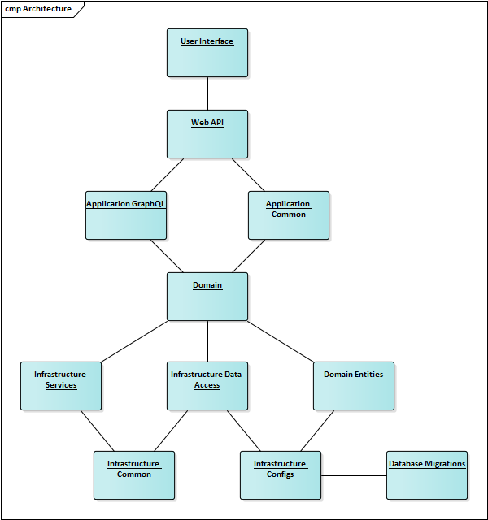
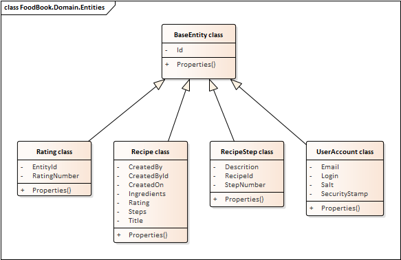

# Architecture analysis

## Comparison of the designed architecture and practically obtained architecture

"To Be" architecture looks like:

"As Is" architecture looks like:

GraphQL module was added in the implemented architecture for the reason that all requests for data will be processed by GraphQL server. This solution allows you to use microservices to implement requests for data.
Infrastructure.DataAccess dependency with Domain.Entities was also removed, since the DataAccess layer should not depend from the business model of the application, respectively, it should not have access to the information stored in the DataAccess layer.

## Class diagram

