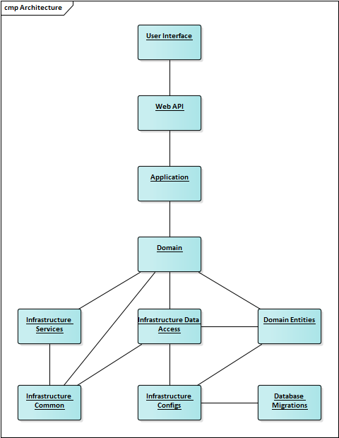

# Анализ архитектурного решения

## Сравнение спроектированной архитектуры и практически полученной архитектуры

Архитектура To Be имеет вид:

Архитектура As Is имеет вид:

В реализованной архитектуре был добавлен модуль GraphQL по причине того, что все запросы на получение данных будут обрабатываться GraphQL сервером. Данное решение позволит вынести запросы на получение данных в микросервис.
Также была удалена зависимость Infrastructure.DataAccess с Domain.Entities, так как DataAccess слой не должен быть привязан к бизнес-модели приложения, соответственно, у него не должно быть доступа к информации, которая хранится в слое DataAccess.

## Диаграмма классов

