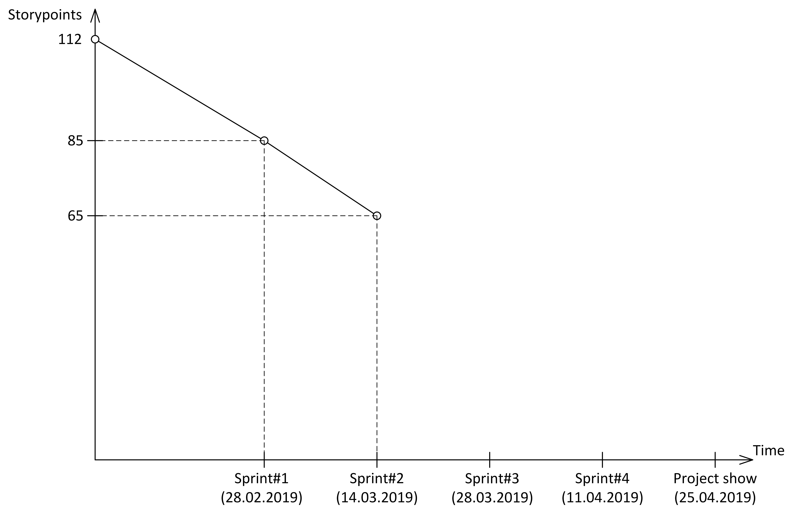

# FoodBook

The FoodBook web app is a recipe manager with rich functionality. FoodBook allows you to search for recipes and sort them by various parameters (complexity of preparation, popularity). If the user signed into the system he can create, modify, delete their culinary recipes. FoodBook’s culinary manager’s distinctive feature is the ability to recognize products from a photograph and search recipes, which include this product.

System Requirements Specification is [here](./Documents/SRS.md).
User Stories are [here](./Documents/UserStory.md).
Burn down chart looks like: 