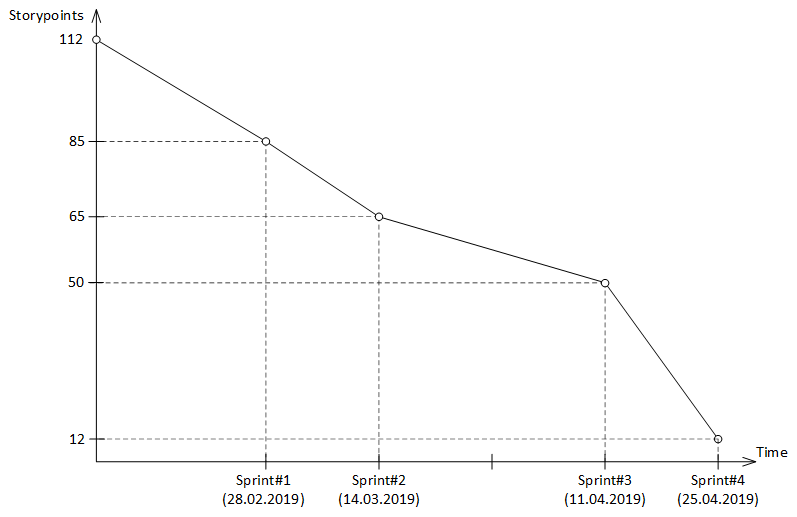

# FoodBook

Веб-приложение FoodBook является менеджером кулинарных рецептов с широкими возможностями.
FoodBook позволяет осуществлять поиск рецептов и сортировку их по различным параметрам (сложность приготовления, популярность).
При наличии учетной записи пользователь может создавать, изменять, удалять свои кулинарные рецепты.
Отличительной функцией менеджера кулинарных рецептов FoodBook является возможность распознавания продуктов по фотографии и
поиска рецептов, в состав которых входит данный продукт.

Спецификация требований к программному обеспечению находится [здесь](./Documents/SRS.md).
Пользовательские истории находятся [здесь](./Documents/UserStory.md).
Диаграмма сгорания задач имеет вид 
